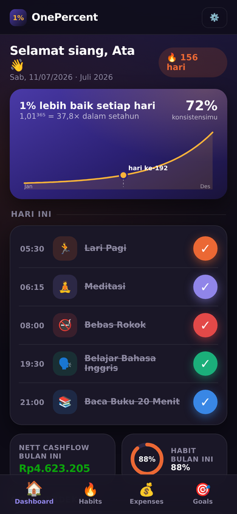
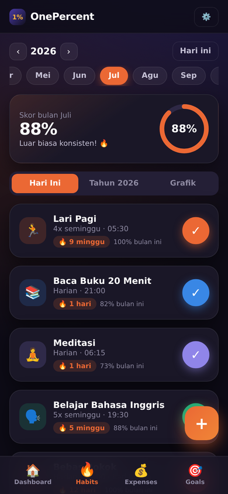
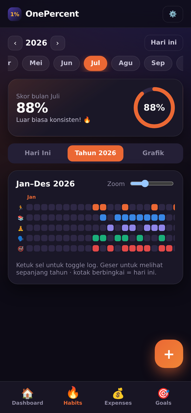
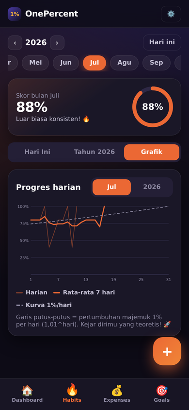
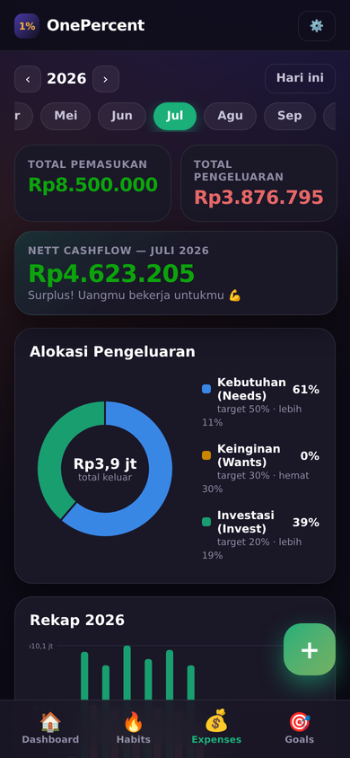
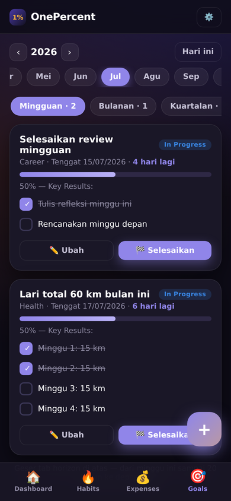

# 📈 OnePercent — Life Routine Tracker

Jadi **1% lebih baik setiap hari**: habit, keuangan, dan goals dalam satu
aplikasi mobile. Phone-first PWA — installable di Android & iOS
(*Add to Home Screen*) dan tetap jalan sebagai web app responsif.

Built with React 19 + Vite + TypeScript + Zustand. Zero chart libraries —
semua grafik SVG tulis-tangan. Offline-first: data tersimpan di perangkat.

| Dashboard | Habits | Year view (Jan–Des) |
|---|---|---|
|  |  |  |

| Grafik 1%/hari | Expenses | Goals |
|---|---|---|
|  |  |  |

## Quick start

```bash
cd onepercent
npm install
npm run dev        # → http://localhost:5173
```

Saat pertama kali dibuka: onboarding 3 layar → pilih **"Coba dengan data
contoh 6 bulan"** untuk melihat semua chart hidup, atau **"Mulai dari nol"**.

```bash
npm run build      # typecheck + production build → dist/
npm run preview    # serve the production build
```

Deploy: `dist/` adalah static site — Vercel/Netlify auto-detect Vite.
Service worker + manifest sudah termasuk, jadi hasil deploy langsung
installable sebagai PWA.

## Fitur (sesuai spesifikasi)

### 🔥 Habit Tracker
- **Year view Jan–Desember**: grid setahun penuh — baris = habit, kolom =
  hari per bulan; tap sel untuk toggle log, slider zoom, scroll halus.
- **Grafik progres harian**: % habit selesai per hari + rata-rata 7 hari +
  kurva referensi putus-putus **1,01^hari** ("kejar dirimu yang teoretis").
- **Diagram habit-loop** (Pemicu → Rutinitas → Hadiah) saat membuat habit,
  plus ring pembentukan 21/66 hari.
- Ubah / tambah / arsipkan / hapus / **perbarui** (riwayat tersimpan,
  hitungan mulai lagi).
- **Persentase bulanan** per habit (hari selesai ÷ hari terjadwal sesuai
  Frekuensi) + skor bulan gabungan.
- Field: **Nama Habit, Frekuensi (Harian, 4x seminggu, dll), Waktu
  Eksekusi, Streak Saat Ini, Log Harian** — plus jenis
  bangun/putus-kebiasaan (break = hari bersih).
- Streak hanya menghitung hari terjadwal (habit 4x/minggu tidak putus di
  hari libur); milestone 7/21/30/66/100/365 → confetti 🎉.

### 💰 Expense Tracker
- **Pemasukan & Pengeluaran** dengan input **Nominal** (pemisah ribuan
  otomatis, format `Rp1.250.000`).
- Pengeluaran dibagi **Kebutuhan / Keinginan / Investasi** (Needs, Wants,
  Invest).
- Kartu statistik animasi: **Total Pemasukan, Total Pengeluaran, Nett
  Cashflow** (hijau surplus / merah defisit).
- **Rekap chart**: donut alokasi vs target rasio (default 50/30/20, bisa
  diubah di Pengaturan) + bar Pemasukan vs Pengeluaran 12 bulan + kategori
  teratas.
- Field: **Tanggal, Nominal, Kategori (bisa tambah sendiri), Jenis Alokasi
  (Needs/Wants/Invest), Catatan/Deskripsi**; riwayat bisa difilter & dicari.

### 🎯 Goals Tracker
- Horizon **Mingguan → Bulanan → Kuartalan → Tahunan → 5 → 10 → 20 Tahun**,
  digeser horizontal dari "minggu ini" sampai masa depan.
- Field: **Nama Goal, Tenggat Waktu (countdown "4 hari lagi"), Kategori,
  Status (Not Started / In Progress / Achieved), Key Results** (1–5,
  progres = rata-rata KR).
- Selesaikan lewat KR terakhir atau tombol **Selesaikan** → perayaan layar
  penuh → masuk **🏆 Hall of Fame**.
- Goal lewat tenggat disorot merah dan muncul sebagai nudge di Dashboard.
- Habit bisa ditautkan ke goal.

### 🏠 Dashboard
- Kartu hero **"1% lebih baik"**: kurva majemuk 1,01^365 = 37,8× dengan
  penanda hari-ke-N dan skor konsistensimu.
- Checklist habit hari ini (interleaved dengan acara kalender), Nett
  Cashflow bulan ini, ring habit, goal terdekat + nudge, dan 🔥 flame
  beruntun.

### 🌐 Aturan global
- **Pemilih periode Jan–Des + tahun** di setiap layar.
- **Konvensi "X" untuk batal**: ketik `X` di kolom input mana pun untuk
  membuang isian (konfirmasi dulu bila form sudah terisi) — selain tombol
  Batal/✕ biasa.
- Label UI Bahasa Indonesia, tanggal DD/MM/YYYY, Rupiah `Rp1.250.000`.
- Semua data auto-save; hapus selalu dengan snackbar **URUNGKAN**.
- Dark mode (default) & light mode; animasi spring, ring, count-up,
  confetti; `prefers-reduced-motion` dihormati.

## Integrasi & statusnya (jujur)

| Integrasi | Status sekarang | Jalan ke produksi |
|---|---|---|
| ⏰ Alarm/pengingat | **Berfungsi** via Web Notifications: pengingat per-habit di Waktu Eksekusi + ringkasan malam 20:00, selama app/PWA terbuka | Push saat app tertutup butuh push server (Web Push/FCM) |
| 🟠 Strava | **Mode demo**: simulasi auto-log habit olahraga + badge Strava & jarak/waktu per hari; tombol sinkron manual | OAuth asli butuh backend kecil untuk token exchange (client secret tidak boleh di client). Daftar app di [strava.com/settings/api](https://www.strava.com/settings/api) |
| 📅 Google Calendar | **Mode demo**: acara contoh tampil interleaved di Dashboard | OAuth + Calendar API via Google Cloud credential |
| 👤 Akun & cloud sync | Profil lokal (offline-first, localStorage) | Supabase/Firebase auth + DB per-user untuk target 10k pengguna |

Struktur kode sudah memisahkan lapisan ini (`lib/notify.ts`, aksi
`syncStrava`, flag `calendarConnected`), jadi menghubungkan backend asli
tidak mengubah UI.

## Struktur proyek

```
onepercent/
  public/            manifest, ikon PWA, service worker (offline cache)
  src/
    types.ts         Habit / Transaction / Goal / Settings
    store.ts         Zustand store + persist + aksi (log, undo, milestone)
    lib/
      date.ts        kalender Indonesia, DD/MM/YYYY, minggu Senin
      format.ts      Rupiah, parser nominal
      habits.ts      streak (harian & Nx/minggu), % bulanan, moving average
      seed.ts        data demo 6 bulan (PRNG deterministik)
      notify.ts      penjadwal pengingat Web Notifications
      confetti.ts    confetti canvas tanpa dependensi
    components/
      ui.tsx         Modal, Ring, CountUp, PeriodSelector, konvensi "X"
      charts.tsx     LineChart / Donut / GroupedBars (SVG + tooltip)
      Dashboard.tsx  hero 1%, timeline hari ini, nudges
      Habits.tsx     list + year grid + grafik progres
      HabitForm.tsx  form + diagram habit-loop + ring 21/66 hari
      Expenses.tsx   stat cards, donut, rekap tahunan, riwayat + form
      Goals.tsx      horizon timeline, KR, Hall of Fame + form
      Settings.tsx   tema, pengingat, rasio target, integrasi, data
      Onboarding.tsx intro 3 layar filosofi 1%
```

## Verifikasi

Dites end-to-end dengan Playwright + Chromium (viewport 390×844):
onboarding → data demo → log habit → year view → grafik → transaksi baru →
goals semua horizon → selesaikan goal (perayaan) → Hall of Fame →
pengaturan → koneksi Strava demo → light mode. **0 error konsol**;
screenshot di `docs/`.
